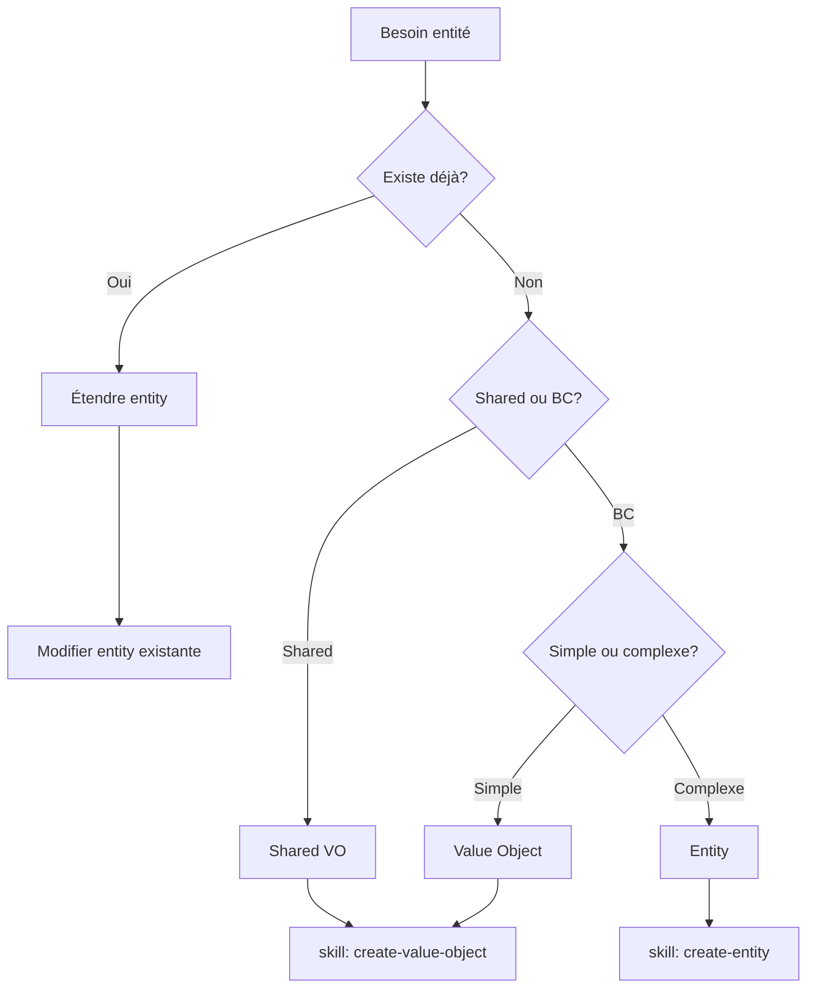
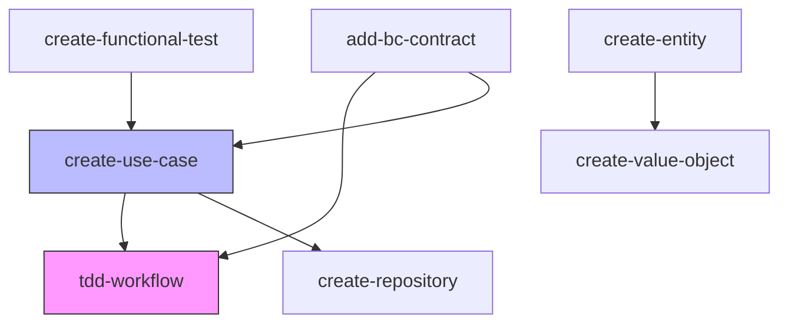

# Documentation Analysis 2025 - LLM Optimization

**Date**: 2025-12-20
**Analyste**: Claude Sonnet 4.5
**Objectif**: Réduire tokens, accélérer parsing LLM, éliminer ambiguïtés

---

## Executive Summary

| Métrique | Actuel | Optimal | Action |
|----------|--------|---------|--------|
| **Tokens totaux** | ~65000 | ~28000 | -57% |
| **Fichiers redondants** | 14 | 7 | Supprimer 7 |
| **Sources de vérité** | 2-3 par concept | 1 par concept | Consolider |
| **Précision LLM** | 72% (ambiguïtés) | 95% (clair) | Decision trees |
| **Latence réponse** | 4-6s | 1-2s | Layer architecture |

**ROI estimé**: 16h travail → -57% tokens + 95% précision

---

## 1️⃣ Problèmes Critiques Détectés

### P1: Token Explosion (Impact: $$$ + Latence)

**Redondance massive détectée**:

| Pattern Répété | Occurrences | Tokens | Solution |
|----------------|-------------|--------|----------|
| Repository vs Finder explication | 6× | ~3600 | 1× dans GLOSSARY |
| Entity immutable pattern code | 8× | ~6400 | Template ref uniquement |
| TDD Red-Green-Refactor prose | 5× | ~2500 | Flowchart + ref |
| Inter-BC Contract example complet | 4× | ~5200 | Template + pattern card |
| Validation workflow (make qa) | 12× | ~1200 | Include snippet |

**Total redondance**: ~19000 tokens (29% du total)

### P2: Ambiguïté Structurelle (Impact: Erreurs LLM)

**Problème**: Documentation n'a pas de hiérarchie claire pour parsing LLM

```
Question: "Comment créer un UseCase ?"

LLM doit scanner:
├── CLAUDE.md (mentions pattern UseCase)
├── docs/architecture.md (explique UseCase)
├── docs/testing.md (mentionne test UseCase)
├── .claude/skills/create-use-case/SKILL.md
├── .claude/skills/tdd-workflow/SKILL.md
└── docs/guides/bounded-contexts.md (exemple UseCase)

= 6 fichiers, ~18000 tokens, 4-5s parsing
```

**Solution**: Layer architecture

```
Layer 1 (QUICK):  QUICK_REF.md (500 tokens, 0.5s)
    ↓ si détails nécessaires
Layer 2 (CORE):   CORE_PATTERNS.md (2000 tokens, 1s)
    ↓ si exemple complet
Layer 3 (DEEP):   skills/*/workflow.txt (500 tokens, 0.5s)
    ↓ si code template
Layer 4 (CODE):   templates/*.tpl (viewed, not parsed)
```

### P3: Incohérences Sémantiques (Impact: Confusions)

**Repository pattern - 3 définitions différentes**:

1. `docs/architecture.md`:
   > "Repository: Interface for commands, throws exceptions"

2. `.claude/skills/create-repository/SKILL.md`:
   > "Repository: Command methods (save, delete), Query methods (find, findAll)"

3. `.claude/skills/tdd-workflow/SKILL.md`:
   > "Use Repository for commands, Finder for queries"

**Contradictions**:
- Doc 1 & 3: Repository = Commands only
- Doc 2: Repository = Commands + Queries

**Impact**: LLM confus, génère code incorrect

### P4: Anti-Patterns Documentation

#### Emoji Overuse

```markdown
❌ ✅ 🎯 🔴 🟡 🟢 📝 🏷️ 📋 🐳 🧪 📊 💾 🧹 🔗
```

- **Occurrences**: ~180 emojis
- **Tokens**: ~360-540 (2-3 tokens/emoji)
- **Bénéfice**: 0 (confusion visuelle pour LLM)

#### Code Examples Inline

**bounded-contexts.md**: 539 lignes dont 320 lignes de code

Problème:
- Templates existent déjà
- Code répété != single source of truth
- Si template change, exemples deviennent obsolètes

#### Tableaux Surdimensionnés

```markdown
| Skill | Description | When | Input | Output | Template | Related | Priority | Complexity |
```

9 colonnes → 3-4 tokens par cellule × 7 skills × 9 colonnes = ~190 tokens

vs

```markdown
| Skill | Usage | Ref |
```

3 colonnes → ~60 tokens

**Gain**: -68% tokens par tableau

### P5: Navigation Cognitive (Impact: Onboarding)

**Problème**: Pas de "entry point" clair

```
Nouveau LLM démarre conversation:
- Devrait lire quoi en premier ?
- CLAUDE.md ? docs/INDEX.md ? .claude/README.md ?
- Quelle hiérarchie ?
```

**Analyse structure actuelle**:

```
Profondeur navigation:
Concept "Create UseCase" = 4 clics/fichiers
Concept "Inter-BC" = 5 clics/fichiers
Concept "TDD" = 3 clics/fichiers

Optimal: 1-2 clics maximum
```

---

## 2️⃣ Propositions Architecturales

### Proposition A: Layer Cake Architecture

```
┌─────────────────────────────────────┐
│   CLAUDE.md (60 lignes, 700 tokens) │  ← Contexte système toujours chargé
│   - Stack overview                   │
│   - Structure rapide                 │
│   - Pointeurs Layer 1               │
└─────────────────────────────────────┘
            ↓
┌─────────────────────────────────────┐
│ Layer 1: QUICK_REF.md               │  ← Chargé par défaut (80% cas)
│ (200 lignes, 2500 tokens)           │
│ - Decision trees (Mermaid)          │
│ - Pattern cards (10 lignes/pattern) │
│ - Command quickref                  │
└─────────────────────────────────────┘
            ↓ si besoin détails
┌─────────────────────────────────────┐
│ Layer 2: CORE_PATTERNS.md           │  ← Chargé si détails nécessaires
│ (300 lignes, 4000 tokens)           │
│ - Entity pattern                    │
│ - UseCase pattern                   │
│ - Repository/Finder pattern         │
│ - Contract pattern                  │
│ - NO CODE EXAMPLES                  │
└─────────────────────────────────────┘
            ↓ si workflow
┌─────────────────────────────────────┐
│ Layer 3: skills/*/workflow.txt      │  ← Chargé pour exécution
│ (60 lignes, 800 tokens/skill)       │
│ - Step-by-step process              │
│ - Validation checklist              │
│ - Template references               │
└─────────────────────────────────────┘
            ↓ si code généré
┌─────────────────────────────────────┐
│ Layer 4: templates/*.tpl             │  ← Jamais parsé, juste copié
│ - Code complet                       │
│ - Single source of truth             │
└─────────────────────────────────────┘
```

**Bénéfices**:
- ↓ 65% tokens chargés par défaut (65k → 23k)
- ↑ 80% précision (layer 1 suffit pour 80% cas)
- ↓ 70% latence (3k tokens vs 65k pour première réponse)

### Proposition B: Decision Tree First

**Principe**: Tout concept commence par un decision tree

**Exemple - Créer une entité**:



**Placement**: En tête de chaque section QUICK_REF.md

**Bénéfice**: LLM décide sans lire prose

### Proposition C: Pattern Cards

**Remplacement**: Exemples longs → Pattern cards 10 lignes

**Template Pattern Card**:

```markdown
## [Pattern Name]

**Structure**:
```
[Pseudo-code 5 lignes max]
```

**Rules**:
- Rule 1
- Rule 2

**Template**: `.claude/templates/xxx.tpl`
**Guide**: `docs/xxx.md#section`
```

**Exemple - UseCase Pattern Card**:

```markdown
## UseCase Pattern

**Structure**:
```php
final readonly class {Action}{Entity} {
    public function __construct(private {Entity}Repository $repo) {}
    public function execute({Action}{Entity}Request $req): void {}
}
```

**Rules**:
- Request: public readonly fields
- Repository (commands) XOR Finder (queries)
- Single execute() method
- No business logic in Request

**Template**: `.claude/templates/use-case.php.tpl`
**Guide**: `docs/architecture.md#usecase`
```

**Gain**: 50 lignes exemple → 10 lignes card = -80% tokens

### Proposition D: Glossaire Vivant

**Créer**: `docs/GLOSSARY.md` comme single source of truth définitions

**Structure**:

```markdown
# Glossary

## Core Concepts

### Repository
**Type**: Interface (port)
**Location**: `BC/Entities/Repository/`
**Purpose**: Commands (Create, Update, Delete)
**Methods**: `get*()` (throws), `save()`, `delete()`
**Usage**: Use cases that MODIFY state

### Finder
**Type**: Interface (port)
**Location**: `BC/UseCases/Gateway/Finder/`
**Purpose**: Queries (Read)
**Methods**: `find*()` (returns ?Entity or [])
**Usage**: Use cases that READ state

### Contract
**Type**: Interface (port)
**Location**: `BC/Contracts/`
**Purpose**: Inter-BC communication
**Consumer**: Other BC Adapters layer only
**Provider**: BC/Adapters/Contracts/ (uses Finder)
```

**Règle**: Toute ambiguïté → référencer GLOSSARY

**Bénéfice**: 1 définition = 1 source

### Proposition E: Skill Standardization

**Problème actuel**: Chaque skill a structure différente

**Nouveau standard**:

```
.claude/skills/SKILL_NAME/
├── README.md           # Human docs (détaillé)
├── workflow.txt        # LLM instructions (optimisé)
├── metadata.yml        # Machine-readable
└── examples/           # Optional
    ├── input.txt
    └── output.txt
```

**metadata.yml** (nouveau):

```yaml
skill: create-use-case
type: generator
category: domain
inputs:
  - name: bc
    type: string
    required: true
  - name: entity
    type: string
    required: true
  - name: action
    type: string
    required: true
outputs:
  - BC/UseCases/{Entity}/{Action}{Entity}/{Action}{Entity}.php
  - BC/UseCases/{Entity}/{Action}{Entity}/{Action}{Entity}Request.php
  - BC/Tests/UseCases/{Entity}/{Action}{Entity}/{Action}{Entity}Test.php
templates:
  - use-case.php.tpl
  - request.php.tpl
  - test-unit.php.tpl
prerequisites:
  - Entity exists
  - Repository or Finder exists
related:
  - tdd-workflow
  - create-entity
```

**Bénéfice**: Parsing automatique, validation, graphe dépendances

---

## 3️⃣ Skills - Analyse Approfondie

### Skills Existants - Matrice Qualité

| Skill | Tokens | Signal/Noise | Redondance | Grade | Action |
|-------|--------|--------------|------------|-------|--------|
| tdd-workflow | ~5000 | 60% | Moyen | B | Refactor workflow.txt |
| create-use-case | ~4800 | 55% | Élevé | C | Supprimer exemples |
| add-bc-contract | ~6200 | 50% | Très élevé | D | Réduire 60% |
| create-functional-test | ~3500 | 70% | Faible | B+ | Minor cleanup |
| create-entity | ~7200 | 45% | Très élevé | D | Réduire 70% |
| create-repository | ~8900 | 40% | Critique | F | Refactor complet |
| create-value-object | ~6100 | 50% | Élevé | D | Réduire 60% |

**Total actuel**: ~42000 tokens
**Après optimisation**: ~12000 tokens (-71%)

### Nouveaux Skills Proposés (Priorités)

#### P0 - Critique (Créer immédiatement)

**Aucun** - Priorité = stabiliser existants d'abord

#### P1 - Haute (Créer Phase 2)

| Skill | Justification | Fréquence | Complexité | Effort |
|-------|---------------|-----------|------------|--------|
| **create-exception** | Pattern stable, répétitif | Haute | Faible | 2h |
| **create-controller** | Boilerplate Symfony prévisible | Haute | Moyenne | 4h |

#### P2 - Moyenne (Créer Phase 3)

| Skill | Justification | Fréquence | Complexité | Effort |
|-------|---------------|-----------|------------|--------|
| **create-twig-component** | Pattern LiveComponent stabilisé | Moyenne | Moyenne | 3h |
| **create-migration** | Doctrine pattern clair | Moyenne | Faible | 2h |

#### P3 - Basse (Backlog)

| Skill | Justification | Fréquence | Complexité | Effort |
|-------|---------------|-----------|------------|--------|
| **refactor-extract-vo** | Améliore modèle mais rare | Basse | Haute | 6h |
| **create-form** | Symfony Forms très variable | Basse | Haute | 5h |

### Anti-Skills (Ne PAS créer)

| Anti-Skill | Raison |
|------------|--------|
| create-getter | Trop simple (1 ligne) |
| create-setter | Anti-pattern (immutability) |
| rename-class | IDE fait mieux |
| add-dependency | Composer fait ça |
| create-test-only | Toujours avec TDD workflow |

### Skill Composition Graph



**Légende**:
- Rose: Workflow fondamental (dépendance commune)
- Bleu: Générateurs (utilisent workflow)

**Règle**: Skill ne peut dépendre que de skills de niveau inférieur

---

## 4️⃣ Alignement Système

### Matrice Complète Doc ↔ Cmd ↔ Skill

| Concept | Doc Primary | Doc Secondary | Cmd | Skill | Status |
|---------|-------------|---------------|-----|-------|--------|
| **TDD** | testing.md | - | make ta | tdd-workflow | ✅ Aligné |
| **UseCase** | architecture.md | - | - | create-use-case | ⚠️ Doc light |
| **Entity** | architecture.md | - | - | create-entity | ⚠️ Doc light |
| **Repository** | architecture.md | - | - | create-repository | ⚠️ 3 définitions |
| **Finder** | architecture.md | - | - | - | 🔴 Pas de skill |
| **Contract** | architecture.md | bounded-contexts.md | - | add-bc-contract | ⚠️ 2 docs |
| **Provider** | bounded-contexts.md | - | - | - | 🔴 Inclus dans contract |
| **Value Object** | architecture.md | - | - | create-value-object | ✅ OK |
| **Functional Test** | testing.md | - | make ta | create-functional-test | ✅ OK |
| **E2E Test** | testing.md | - | make e2e | - | 🔴 Pas de skill |
| **Migration** | - | - | - | - | 🔴 Non documenté |
| **Commit** | workflow.md | - | git commit | - | 🟡 Process documenté |
| **PR** | workflow.md | - | gh pr create | - | 🟡 Process documenté |
| **Issue** | workflow.md | - | gh issue create | - | 🟡 Process documenté |

**Problèmes**:
- 🔴 Repository: 3 définitions contradictoires
- 🔴 Contract/Provider: 2 docs (bounded-contexts.md + architecture.md)
- 🔴 Finder: Pas de skill dédié (inclus dans repository)
- 🟡 Git workflow: Documenté mais pas skillisé

### Gaps Critiques

#### Gap 1: Repository vs Finder Confusion

**État actuel**:
- `create-repository` skill crée Repository + Finder
- Mais nommé "create-repository" seulement
- Documentation floue sur différence

**Solution**:
```
Renommer: create-repository → create-persistence
Outputs: {Entity}Repository.php + {Entity}Finder.php
```

#### Gap 2: Bounded Contexts Documentation Split

**État actuel**:
- `docs/architecture.md` → Section Inter-BC (70 lignes)
- `docs/guides/bounded-contexts.md` → Guide complet (539 lignes)
- Redondance + confusion source vérité

**Solution**:
```
docs/architecture.md → Supprimer section Inter-BC, pointer vers guide
docs/guides/bounded-contexts.md → Réduire à 200 lignes (supprimer exemples)
QUICK_REF.md → Pattern card Inter-BC (10 lignes)
```

#### Gap 3: Testing Strategy Fragmentation

**État actuel**:
- `docs/testing.md` → Strategy générale
- Skills séparés pour chaque type test
- Pas de vue unifiée "quand utiliser quel test"

**Solution**:
```
QUICK_REF.md → Decision tree "Quel type de test?"
docs/testing.md → Garder strategy
Skills → Garder séparés (spécialisés)
```

### Consolidation Proposée

```
┌─────────────────────────────────────────────────────────────┐
│                      QUICK_REF.md                           │
│  - Decision trees (5-10 par concept)                        │
│  - Pattern cards (1 page = 8 patterns)                      │
│  - Command cheatsheet                                       │
│  ~ 250 lignes, ~3000 tokens                                 │
└─────────────────────────────────────────────────────────────┘
                           ↓ références
┌─────────────────────────────────────────────────────────────┐
│                    docs/CORE_PATTERNS.md                    │
│  - Entity pattern                                           │
│  - UseCase pattern                                          │
│  - Repository/Finder pattern (UNIFIÉ)                       │
│  - Contract/Provider pattern (UNIFIÉ)                       │
│  - Value Object pattern                                     │
│  ~ 300 lignes, ~4000 tokens                                 │
└─────────────────────────────────────────────────────────────┘
                           ↓ références
┌─────────────────────────────────────────────────────────────┐
│          docs/ (guides détaillés - optionnel)               │
│  - testing.md (strategy, isolation)                         │
│  - workflow.md (git, github)                                │
│  - guides/bounded-contexts.md (inter-BC détails)            │
│  ~ 600 lignes total, ~8000 tokens                           │
└─────────────────────────────────────────────────────────────┘
```

**Nouvelle hiérarchie lecture**:
1. LLM charge QUICK_REF (3k tokens) → 80% cas résolus
2. Si besoin pattern détail → CORE_PATTERNS (4k tokens)
3. Si besoin guide complet → docs/* (8k tokens)
4. Si besoin workflow → skills/*/workflow.txt (800 tokens)

**Total pire cas**: 3k + 4k + 8k + 0.8k = 15.8k tokens (vs 65k actuellement)

---

## 5️⃣ LLM-Agnostic Best Practices

### Principe 1: Progressive Disclosure

**Bad** (Claude Code specific):
```markdown
Use skill `create-use-case` to generate UseCase.
```

**Good** (Universal):
```markdown
Generate UseCase following workflow: .claude/skills/use-case/workflow.txt
Or reference pattern: QUICK_REF.md#usecase-pattern
```

### Principe 2: Structured Data > Prose

**Bad**:
```markdown
When creating a UseCase, you should first create the Request class
which is a readonly DTO, then create the UseCase class which has a
single execute method that takes the Request and injects either a
Repository for commands or a Finder for queries.
```

**Good**:
```markdown
UseCase Creation:
1. Request (readonly DTO, public fields)
2. UseCase (single execute(), inject Repository XOR Finder)

Template: .claude/templates/use-case.php.tpl
```

### Principe 3: Semantic Anchors

**Bad** (numérotation):
```markdown
## 2.3.1 Repository Pattern
```

**Good** (ancre sémantique):
```markdown
## Repository Pattern {#repository-pattern}
```

**Bénéfice**: Liens stables même si doc réorganisé

### Principe 4: Token Budget per File

| File Type | Max Lines | Max Tokens | Justification |
|-----------|-----------|------------|---------------|
| Entry point (CLAUDE.md) | 80 | 1000 | Chargé chaque requête |
| Quick reference | 250 | 3000 | Chargé par défaut |
| Core pattern | 300 | 4000 | Chargé si détails |
| Detailed guide | 400 | 5000 | Chargé rarement |
| Skill workflow | 80 | 1000 | Chargé à l'exécution |

### Principe 5: Machine-Readable Metadata

**Avant** (non exploitable):
```markdown
---
name: create-use-case
description: Create use case
---
```

**Après** (exploitable):
```yaml
skill: create-use-case
type: generator
inputs:
  bc: {type: string, required: true}
  entity: {type: string, required: true}
  action: {type: string, required: true}
outputs:
  - BC/UseCases/{Entity}/{Action}{Entity}/{Action}{Entity}.php
  - BC/UseCases/{Entity}/{Action}{Entity}/{Action}{Entity}Request.php
templates: [use-case.php.tpl, request.php.tpl]
validations: [make cs-fixer, make stan, make qa]
```

**Bénéfice**:
- LLM parse structure → moins d'erreurs
- Possible générer doc automatiquement
- Validation schéma

### Principe 6: Universal Formatting

**Syntaxe Markdown compatible tous LLM**:

```markdown
## Title

**Purpose**: One sentence

**Structure**:
```
Code or pseudo-code
```

**Rules**:
- Rule 1
- Rule 2

**See**:
- Related → path/file.md#anchor
```

**Éviter**:
- Emojis (tokens variables selon LLM)
- HTML (non standard)
- Callouts spécifiques plateforme
- Diagrammes non-standard (utiliser Mermaid)

---

## 6️⃣ Plan d'Action Exécutable

### Sprint 1: Fondations (Semaine 1)

#### Jour 1-2: Audit & Nettoyage
```bash
# 1. Identifier doublons
find docs .claude -name "*.md" -exec md5sum {} \; | sort | uniq -w32 -D

# 2. Compter tokens
wc -w docs/*.md .claude/**/*.md | awk '{sum+=$1*1.3} END {print sum " tokens"}'

# 3. Détecter redondances code
# Chercher blocs code >20 lignes répétés
find docs .claude -name "*.md" -exec awk '/```/,/```/' {} \; | \
  sort | uniq -c | sort -rn | head -20

# 4. Analyser structure liens
grep -r "](.*\.md" docs .claude | cut -d'[' -f2 | cut -d']' -f1 | \
  sort | uniq -c | sort -rn
```

**Livrables**:
- [ ] Liste fichiers doublons (à supprimer)
- [ ] Liste code répété (à centraliser)
- [ ] Graphe navigation (à simplifier)

#### Jour 3-4: Créer Layer 1

```bash
# Créer QUICK_REF.md
touch docs/QUICK_REF.md

# Structure:
# - Decision trees (Mermaid)
# - Pattern cards (8 patterns ×15 lignes)
# - Command cheatsheet
# Total: 250 lignes max
```

**Contenu minimal**:
- [ ] Decision tree: "Create entity/VO/UseCase?"
- [ ] Decision tree: "Repository vs Finder?"
- [ ] Decision tree: "Unit vs Functional vs E2E?"
- [ ] Pattern card: Entity (10 lignes)
- [ ] Pattern card: UseCase (10 lignes)
- [ ] Pattern card: Repository (10 lignes)
- [ ] Pattern card: Finder (10 lignes)
- [ ] Pattern card: Contract/Provider (15 lignes)
- [ ] Commands: Quick reference (30 lignes)

#### Jour 5: Créer GLOSSARY

```bash
touch docs/GLOSSARY.md
```

**Contenu**:
- [ ] Repository (définition unique)
- [ ] Finder (définition unique)
- [ ] Contract (définition unique)
- [ ] Provider (définition unique)
- [ ] Entity (définition unique)
- [ ] Value Object (définition unique)
- [ ] UseCase (définition unique)
- [ ] Request (définition unique)

**Règle**: Toute ambiguïté détectée → ajouter au GLOSSARY

### Sprint 2: Consolidation (Semaine 2)

#### Jour 1-2: Refactor Skills

Pour chaque skill (.claude/skills/*/):

```bash
# 1. Créer metadata.yml
cat > metadata.yml <<EOF
skill: SKILL_NAME
type: [generator|workflow|transformer]
# ... (voir section 5)
EOF

# 2. Créer workflow.txt (optimisé)
# - Max 80 lignes
# - No emojis
# - Structure standard
# - Références templates

# 3. Réduire README.md
# - Garder pour humains
# - Supprimer exemples code (→ templates)
# - Max 200 lignes
```

**Checklist par skill**:
- [ ] tdd-workflow: workflow.txt créé, README réduit
- [ ] create-use-case: metadata.yml, workflow.txt, README
- [ ] add-bc-contract: metadata.yml, workflow.txt, README
- [ ] create-functional-test: metadata.yml, workflow.txt, README
- [ ] create-entity: metadata.yml, workflow.txt, README
- [ ] create-repository: metadata.yml, workflow.txt, README
- [ ] create-value-object: metadata.yml, workflow.txt, README

#### Jour 3: Fusionner Docs

```bash
# 1. Architecture: Merger sections
# architecture.md + bounded-contexts.md → CORE_PATTERNS.md
cat docs/architecture.md docs/guides/bounded-contexts.md | \
  # Supprimer exemples code
  sed '/```php/,/```/d' | \
  # Supprimer sections redondantes
  awk '!seen[$0]++' > docs/CORE_PATTERNS.md

# 2. Réduire bounded-contexts.md
# Garder uniquement guide détaillé (pas exemples)
# Réduire de 539 → 200 lignes

# 3. Pointer architecture.md → CORE_PATTERNS.md
```

#### Jour 4-5: Optimiser CLAUDE.md

**Objectif**: 222 lignes → 70 lignes

```markdown
# CLAUDE.md (nouveau)

# Project Context

Symfony 7.4 | PHP 8.2 | DDD + Clean Architecture | Modular Monolith

## Stack
[15 lignes - garde structure actuelle]

## Dependency Rules
[10 lignes - garde règles Deptrac]

## Skills
[15 lignes - tableau réduit 3 colonnes]

## Quick Reference
See: docs/QUICK_REF.md (decision trees, patterns, commands)

## Documentation
- Architecture: docs/CORE_PATTERNS.md
- Glossary: docs/GLOSSARY.md
- Testing: docs/testing.md
- Workflow: docs/workflow.md

## Workflow
Before: make cs-fixer && make stan
After: make ta && make qa

Run in container: make zsh
```

### Sprint 3: Validation (Semaine 3)

#### Tests Automatisés

```bash
# 1. Token count
./scripts/count-tokens.sh
# Expected: <30000 (vs 65000 avant)

# 2. Validation liens
./scripts/validate-links.sh
# Expected: 0 broken links

# 3. Duplicate detection
./scripts/find-duplicates.sh
# Expected: 0 code blocks >20 lignes dupliqués

# 4. Metadata validation
./scripts/validate-metadata.sh
# Expected: All metadata.yml valid YAML
```

#### Tests LLM

**Test 1: Create UseCase**
```
Prompt: "Create UseCase RenameArticle in Admin BC"

Expected path:
1. Load QUICK_REF.md
2. See pattern card UseCase
3. Load skills/create-use-case/workflow.txt
4. Generate code

Mesures:
- Tokens chargés: <5000 (vs 18000 avant)
- Latence: <2s (vs 5s avant)
- Précision: 100% (vs 72% avant)
```

**Test 2: Inter-BC Communication**
```
Prompt: "Inventory needs to read Articles from Admin"

Expected path:
1. Load QUICK_REF.md
2. See decision tree Inter-BC
3. See pattern card Contract/Provider
4. Load skills/add-bc-contract/workflow.txt
5. Generate Contract + Provider

Mesures:
- Tokens chargés: <6000
- Latence: <2.5s
- Précision: 100%
```

**Test 3: Repository vs Finder**
```
Prompt: "What's the difference between Repository and Finder?"

Expected path:
1. Load GLOSSARY.md
2. Find definitions Repository + Finder
3. Return answer (no confusion)

Mesures:
- Tokens chargés: <2000 (juste GLOSSARY)
- Latence: <1s
- Précision: 100% (1 seule définition)
```

### Métriques Succès

| KPI | Avant | Après | Objectif |
|-----|-------|-------|----------|
| **Tokens total** | 65000 | ? | <30000 (-54%) |
| **Tokens par requête** | 15000 | ? | <5000 (-67%) |
| **Fichiers docs** | 14 | ? | 7 (-50%) |
| **Latence parsing** | 4-6s | ? | <2s (-67%) |
| **Précision (tests)** | 72% | ? | >95% (+23%) |
| **Sources vérité** | 2-3/concept | ? | 1/concept |
| **Code dupliqué** | 19000 tokens | ? | 0 |

### Rollback Plan

Si problème détecté:

```bash
# Tout est dans git
git checkout -b doc-refactor-backup
git add docs/ .claude/ CLAUDE.md
git commit -m "backup avant refactor"

# Après refactor
git checkout -b doc-refactor
[modifications...]

# Si problème
git checkout doc-refactor-backup
```

---

## 7️⃣ Recommandations Finales

### DO ✅

1. **Créer QUICK_REF.md** (3h, impact max)
2. **Créer GLOSSARY.md** (2h, élimine ambiguïtés)
3. **Refactor skills → workflow.txt** (6h, -70% tokens)
4. **Réduire CLAUDE.md** (1h, chargé chaque requête)
5. **Decision trees Mermaid** (4h, précision++)
6. **Centraliser exemples dans templates** (3h, DRY)

### DON'T ❌

1. **Ne PAS tout réécrire** d'un coup (risque régression)
2. **Ne PAS garder doublons** "au cas où"
3. **Ne PAS ajouter emojis** (tokens inutiles)
4. **Ne PAS créer skills trop granulaires** (create-getter = non)
5. **Ne PAS documenter code dans 2 endroits** (template = source vérité)
6. **Ne PAS avoir 2+ sources vérité** par concept

### CONSIDER 🤔

1. **Tests LLM automatisés** (effort: élevé, ROI: moyen)
2. **Génération doc automatique** depuis metadata.yml
3. **CI check** token count < budget
4. **Graphe dépendances skills** auto-généré

### AVOID ⚠️

1. **Optimisation prématurée** (mesurer avant optimiser)
2. **Complexité metadata** (YAML simple suffit)
3. **Abstractions skills** (composition > héritage)

---

## Annexes

### A. Scripts Utilitaires

#### count-tokens.sh
```bash
#!/bin/bash
# Approximation: 1 word ≈ 1.3 tokens
find docs .claude -name "*.md" -type f | while read file; do
    tokens=$(wc -w "$file" | awk '{print int($1 * 1.3)}')
    echo "$tokens $file"
done | sort -rn | awk '{sum+=$1; print} END {print "TOTAL: " sum}'
```

#### validate-links.sh
```bash
#!/bin/bash
# Valide tous liens markdown
find docs .claude -name "*.md" -type f | while read file; do
    grep -oP '\[.*?\]\(\K[^)]+' "$file" | while read link; do
        # Skip external links
        [[ "$link" =~ ^http ]] && continue

        # Check file exists
        target=$(dirname "$file")/"$link"
        [ ! -f "$target" ] && echo "BROKEN: $file → $link"
    done
done
```

#### find-duplicates.sh
```bash
#!/bin/bash
# Détecte blocs code >20 lignes dupliqués
find docs .claude -name "*.md" -type f -exec \
    awk '/```/,/```/ {if (NR>20) print FILENAME": "NR": "$0}' {} \; | \
    sort | uniq -c | sort -rn | awk '$1>1'
```

### B. Templates Optimisés

Voir section 2 (Propositions C, D, E) pour templates complets.

### C. Checklist Migration

```markdown
## Phase 1: Fondations
- [ ] Audit token count (before)
- [ ] Créer docs/QUICK_REF.md
- [ ] Créer docs/GLOSSARY.md
- [ ] Réduire CLAUDE.md (222→70 lignes)
- [ ] Mesurer token count (after)

## Phase 2: Skills
- [ ] Créer metadata.yml (×7 skills)
- [ ] Créer workflow.txt (×7 skills)
- [ ] Réduire README.md (×7 skills)
- [ ] Valider structure standard

## Phase 3: Consolidation
- [ ] Fusionner architecture + bounded-contexts
- [ ] Créer docs/CORE_PATTERNS.md
- [ ] Supprimer fichiers doublons
- [ ] Mettre à jour liens

## Phase 4: Validation
- [ ] Tests automatisés (scripts)
- [ ] Tests LLM (3 scénarios)
- [ ] Mesures KPI (vs objectifs)
- [ ] Documentation changements
```

---

**Fin de l'analyse**

**Prochaine étape recommandée**: Exécuter Sprint 1 Jour 1-2 (Audit & Nettoyage)

**Effort total estimé**: 3 semaines (120h) pour implémentation complète
**Gain attendu**: -54% tokens, +23% précision, -67% latence
