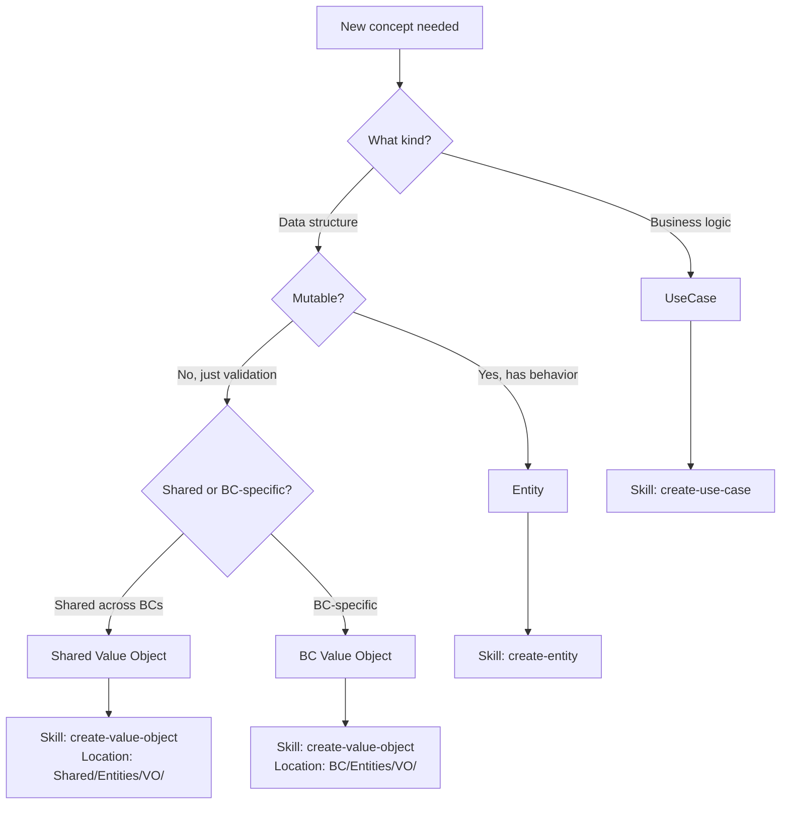
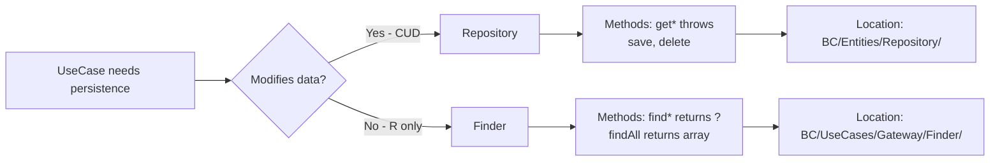
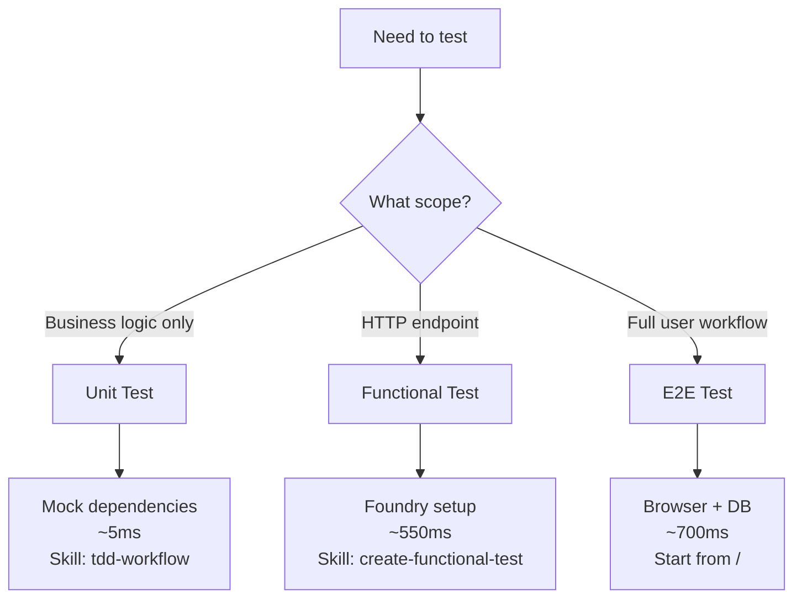
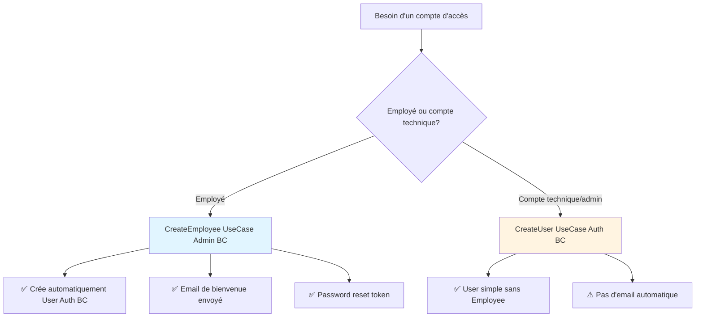

# Quick Reference

**Purpose**: Fast decision-making and pattern reference for 80% of common tasks

**Token budget**: ~2500 tokens (load first, sufficient for most cases)

---

## Decision Trees

### When to Create Entity vs Value Object vs UseCase?



### Repository vs Finder?



### Which Test Type?



---

## Pattern Cards

### Entity Pattern

**Structure**:
```php
final class Entity {
    private function __construct(private ResourceUuid $uuid, private NameField $name) {}
    public static function create(string $name): self {}
    public function uuid(): ResourceUuid {}
    public function rename(string $name): void {}
}
```

**Rules**:
- `final` class, private constructor, static factory
- Use Value Objects (not primitives)
- Behavior methods modify state (no setters)

**Template**: `.claude/templates/entity.php.tpl`

**ORM Entity (Adapters layer)**:
- MAY have mutation methods (`start()`, `rename()`, `updateStatus()`)
- These are mapping methods, NOT business logic
- Business logic stays in Domain Entity

---

### UseCase Pattern

**Structure**:
```php
final readonly class ActionEntity {
    public function __construct(private EntityRepository $repo) {}
    public function execute(ActionEntityRequest $req): ActionEntityResponse {
        // Business logic
        return new ActionEntityResponse($entity);
    }
}
```

**Rules**:
- `readonly` class, inject Repository XOR Finder
- Single `execute()` method
- Repository for commands, Finder for queries

**Template**: `.claude/templates/use-case.php.tpl`

---

### Request Pattern

**Structure**:
```php
interface ActionEntityRequest {
    public function field(): string;
}
```

**Rules**:
- interface with getters only

**Template**: `.claude/templates/request.php.tpl`

---

### Repository Pattern (Commands)

**Structure**:
```php
interface EntityRepository {
    public function getByUuid(ResourceUuid $uuid): Entity; // throws
    public function create(Entity $entity): void;          // Création
    public function rename(Entity $entity): void;          // Action métier spécifique
    public function start(Entity $entity): void;           // Action métier spécifique
    public function delete(Entity $entity): void;
}
```

**Example - When to use `update()` vs business-named methods**:
```php
// ❌ BAD - Pure duplication (all methods identical)
interface EmployeeRepository {
    public function updateContactInfo(Employee $e): void; // fetch + sync + flush
    public function updatePosition(Employee $e): void;    // fetch + sync + flush
    public function disable(Employee $e): void;           // fetch + sync + flush
}

// ✅ GOOD - Consolidate identical operations
interface EmployeeRepository {
    public function update(Employee $e): void; // Domain modified, just persist
}

// ✅ ALSO GOOD - Different implementations justify separate methods
interface ArticleRepository {
    public function revaluate(Article $a): void;  // Recalculates price + logs change
    public function rename(Article $a): void;      // Updates name + slug + search index
    public function publish(Article $a): void;     // Updates status + notifies subscribers
}
```

**Rules**:
- Interface in `BC/Entities/Repository/`
- Methods: `get*()` MUST throw if not found
- Method naming strategy:
  - Use business-named methods (`rename`, `start`, `revaluate`) when implementations DIFFER (e.g., different SQL, specific optimizations)
  - Use generic `update()` when all update operations have IDENTICAL implementation (fetch + sync + flush)
  - Reason: Domain ensures data consistency, Repository is pure persistence layer
- Used by: Use cases that MODIFY state

**Exception - Reads au service de writes**:
```php
// ✅ OK - Read nécessaire à l'invariant du write (unicité)
interface UserRepository {
    public function emailExists(EmailField $email): bool; // Vérifie unicité avant create()
}
// ❌ Pas dans Repository - Read pour affichage → Finder
```

**Template**: `.claude/templates/repository.php.tpl`

---

### Finder Pattern (Queries)

**Structure**:
```php
interface EntityFinder {
    public function find(ResourceUuid|string $uuid): ?Entity;
    public function findAll(): array;
    public function findByName(string $name): ?Entity;
}
```

**Rules**:
- Interface in `BC/UseCases/Gateway/Finder/`
- Methods: `find*()` MAY return null or empty array
- Used by: Use cases that READ state

**Template**: `.claude/templates/finder.php.tpl`

---

### Value Object Pattern

**Structure**:
```php
final readonly class NameField {
    private function __construct(private string $value) {}
    public static function fromString(string $value): self {} // validates
    public function toString(): string {}
    public function equals(self $other): bool {}
}
```

**Rules**:
- `final readonly`, private constructor
- Static factory validates, immutable
- Location: `Shared/Entities/VO/` (shared) or `BC/Entities/VO/` (BC-specific)

**Template**: `.claude/templates/value-object.php.tpl`

---

### Contract Pattern (Inter-BC)

**Structure**:
```php
// BC1/Contracts/EntityProvider.php
interface EntityProvider {
    public function provide(string $uuid): EntityData;
    public function provideAll(?array $ids = null): iterable;
}

// BC1/Adapters/Contracts/BC1EntityProvider.php
final readonly class BC1EntityProvider implements EntityProvider {
    public function __construct(private EntityFinder $finder) {} // Use Finder
}
```

**Rules**:
- Contract in `BC/Contracts/`, Provider in `BC/Adapters/Contracts/`
- Provider uses Finder (NOT Repository)
- Consumer BC depends ONLY on contract interface
- Deptrac enforces: BC2\Adapters → BC1\Contracts only

**When to use**:
- BC needs to use other BC entities that are not Shared BC

**Template**: `.claude/templates/contract.php.tpl`, `provider.php.tpl`

---

### Test Pattern (Unit)

**Structure**:
```php
final class ActionEntityTest extends TestCase {
    public function testAction(): void {
        $entity = EntityDataBuilder::anEntity()->build();
        $repo = $this->createMock(EntityRepository::class);
        $repo->expects($this->once())->method('save');

        $useCase = new ActionEntity($repo);
        $useCase->execute(new ActionEntityRequest('value'));
    }
}
```

**Rules**:
- Use DataBuilder (NOT Foundry for unit tests)
- Mock dependencies with `expects()->once()`
- Test business logic, not infrastructure

**When to use**:
- DataBuilder create entity with all fields set
- Foundry register entities into database
- Mock dependencies for isolation
  - contracts from other BC (functional tests)
  - all interfaces (unit tests)

**Template**: `.claude/templates/test-unit.php.tpl`

---

## Command Cheatsheet

### Code Generation (Symfony Makers)

```bash
# Create new Bounded Context (structure + config)
bin/console make:bounded-context:init <name>

# Create new Use Case (UseCase + Request + Response + Presenter + Test)
bin/console make:use-case:create <bc> <use-case>
```

**Note**: Makers generate Request-Response-Presenter pattern. Skills generate Request-UseCase-Test pattern (simpler).

**See**: `docs/reference.md#symfony-makers` for details

### Quality Workflow

```bash
# Before code
make cs-fixer && make stan

# After implementation
make ta          # Tests (unit + functional)
make qa          # Full quality gates

# Individual
make cs-fixer    # Auto-fix PSR-12
make stan        # PHPStan level 9
make deptrac     # Validate architecture
```

### Test Commands

```bash
make tu          # Unit tests only
make tf          # Functional tests only
make ta          # Unit + Functional
make e2e         # E2E (Panther)

# Specific test
php bin/phpunit path/to/Test.php
```

### Database

```bash
make reload      # Reset DB + fixtures
make clean-db-test  # Reset test DB
```

### Docker

```bash
make zsh         # Connect to container (run commands here)
make up          # Start containers
make down        # Stop containers
```

---

## Naming Conventions

| Element | Pattern | Example |
|---------|---------|---------|
| Entity | `{Name}` | Article, Supplier |
| Value Object | `{Name}Field` | NameField, EmailField |
| UseCase | `{Action}{Entity}` | CreateArticle, RenameSupplier |
| Request | `{UseCase}Request` | CreateArticleRequest |
| Test | `{UseCase}Test` | CreateArticleTest |
| Repository | `{Entity}Repository` | ArticleRepository |
| Finder | `{Entity}Finder` | ArticleFinder |
| Contract | `{Entity}Provider` | ArticleProvider |
| Provider Impl | `{BC}{Contract}` | AdminArticleProvider |

---

## Dependency Rules (Deptrac enforced)

### Intra-BC

```
Entities  → Shared\Entities only
UseCases  → Entities + Shared\Entities
Adapters  → UseCases + Entities + Shared + OtherBC\Contracts
```

Rule: Inner layers NEVER depend on outer layers

### Inter-BC

```
OK: BC1\Adapters → BC2\Contracts (interface only)
NO: BC1 → BC2\Entities
NO: BC1 → BC2\UseCases
```

---

## TDD Workflow (MANDATORY)

```
1. RED    → Write failing test (php bin/phpunit path/to/Test.php)
2. GREEN  → Minimal implementation (test passes)
3. REFACTOR → make cs-fixer && make stan && make ta
4. VALIDATE → make qa
```

**Skill**: `.claude/skills/tdd-workflow/`

---

## Skills Quick Reference

| Skill | Usage | Ref |
|-------|-------|-----|
| **tdd-workflow** | All implementations (MANDATORY) | `.claude/skills/tdd-workflow/` |
| **create-use-case** | New business use case | `.claude/skills/create-use-case/` |
| **add-bc-contract** | Inter-BC communication | `.claude/skills/add-bc-contract/` |
| **create-functional-test** | HTTP/LiveComponent test | `.claude/skills/create-functional-test/` |
| **create-entity** | Domain entity | `.claude/skills/create-entity/` |
| **create-repository** | Persistence layer | `.claude/skills/create-repository/` |
| **create-value-object** | Domain value type | `.claude/skills/create-value-object/` |

---

### Decision Tree: Créer User ou Employee?



**Règle**: Si Employee → utiliser CreateEmployee (crée User automatiquement)
**Exception**: Comptes techniques (admins système, bots) → CreateUser direct

**Reference**: `docs/admin-employee-management.md`, `docs/adr/ADR-008-employee-user-coupling.md`

---

### Communication Inter-BC: Admin → Auth

**Pattern**: Command Gateway

```
Admin BC (Consumer)               Auth BC (Provider)
─────────────────────           ─────────────────────
  UseCase                           UseCase
     │                                  ▲
     │ depends on                       │
     ▼                                  │
  Gateway (interface)                   │
     ▲                                  │
     │ implements                       │
     │                                  │
  Adapter ────────── calls ─────────────┘
              (via Contract)
```

**Example**: UserCreatorAdapter

```php
// 1. Gateway (interface) dans Admin BC
interface UserCreatorGateway {
    public function createUser(CreateUserDTO $dto): CreatedUserDTO;
}

// 2. Adapter (implementation) dans Admin BC
#[AsAlias(UserCreatorGateway::class)]
final readonly class UserCreatorAdapter implements UserCreatorGateway {
    public function __construct(
        private CreateUserCommandHandler $userCreator, // Auth BC Contract
    ) {}
}

// 3. Contract (interface) dans Auth BC
interface CreateUserCommandHandler {
    public function createUser(CreateUserCommand $command): CreatedUserResult;
}
```

**Skill**: `add-bc-contract` pour ajouter nouveau Contract

**Reference**: `docs/guides/bounded-contexts.md`, `docs/admin-employee-management.md#4-communication-inter-bc`

---

### Tester Communication Inter-BC

**Unit Test**: Mock le Gateway

```php
public function testCreateEmployeeCallsUserCreatorGateway(): void
{
    $userCreatorGateway = $this->createMock(UserCreatorGateway::class);
    $userCreatorGateway->expects($this->once())
        ->method('createUser')
        ->willReturn(new CreatedUserDTO(ResourceUuid::generate(), $email));

    $useCase = new CreateEmployee(
        repository: $repository,
        userCreatorGateway: $userCreatorGateway, // ✅ Mock
        // ...
    );
}
```

**Integration Test**: Tester transaction complète (rollback)

```php
public function testRollbackWhenPasswordResetTokenFailsRevertsAll(): void
{
    $passwordResetGateway = $this->createMock(PasswordResetGateway::class);
    $passwordResetGateway->expects($this->once())
        ->method('createResetToken')
        ->willThrowException(new \RuntimeException('Token failed'));

    try {
        $useCase->execute($request);
    } finally {
        $this->entityManager->clear();

        // ✅ Vérifie que Employee ET User ont été rollback
        $this->assertSame(0, $this->employeeRepository->count([]));
        $this->assertSame(0, $this->userRepository->count([]));
    }
}
```

**Example**: `src/Admin/Tests/Integration/Employee/CreateEmployeeTransactionTest.php`

**Reference**: `docs/admin-employee-management.md#7-testing-strategy`

---

## Common Questions

**Q: Repository or Finder?**
A: See decision tree above. Repository = CUD (throws), Finder = R (returns null/array)

**Q: Shared or BC-specific Value Object?**
A: Shared if used across multiple BCs (ResourceUuid, NameField). BC-specific otherwise.

**Q: Unit, Functional, or E2E test?**
A: See decision tree above. Unit = logic only, Functional = HTTP, E2E = full workflow

**Q: Where to put Contract?**
A: Contract in `BC/Contracts/`, Provider in `BC/Adapters/Contracts/`

**Q: Can BC1 use BC2 Entity?**
A: NO. Only Contract interface allowed. See Inter-BC dependency rules.

---

## See Also

- **Glossary**: `docs/GLOSSARY.md` (definitions)
- **Core Patterns**: `docs/CORE_PATTERNS.md` (detailed patterns)
- **Architecture**: `docs/architecture.md` (DDD, Clean Arch)
- **Testing**: `docs/testing.md` (strategy, isolation)
- **Workflow**: `docs/workflow.md` (git, github)
- **Bounded Contexts**: `docs/guides/bounded-contexts.md` (inter-BC guide)

---

**Lines**: 248
**Estimated tokens**: ~2500
**Coverage**: 80% common tasks
