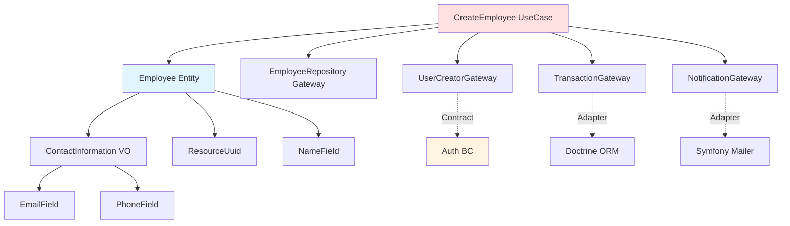

# Admin BC - Employee Management

**Purpose**: Guide complet de la gestion des employés (Admin BC) avec création automatique de User (Auth BC).

---

## Table of Contents

1. [Vision & Purpose](#1-vision--purpose)
2. [Architecture](#2-architecture)
3. [UseCases Implémentés](#3-usecases-implémentés)
4. [Communication Inter-BC](#4-communication-inter-bc)
5. [Gateways Transversaux](#5-gateways-transversaux)
6. [Workflow Password Reset](#6-workflow-password-reset)
7. [Testing Strategy](#7-testing-strategy)
8. [Code Locations](#8-code-locations)
9. [Skills & References](#9-skills--references)

---

## 1. Vision & Purpose

### Objectifs métier

Le système de gestion des employés répond aux besoins suivants :

- **CRUD Employee** : Créer, lire, modifier, désactiver des employés
- **Liaison User automatique** : Chaque Employee crée un User (Auth BC) pour l'accès système
- **Soft delete** : Désactivation réversible (conservation historique, audit RGPD)
- **Password reset workflow** : Première connexion avec email de bienvenue
- **Communication inter-BC** : Admin BC → Auth BC via Contracts (pas de couplage direct)

### Relation Employee ↔ User

```
┌─────────────────────────────────────────────────────────────┐
│  Admin BC (Bounded Context)                                 │
│  ┌─────────────────────────────────────────────────────┐   │
│  │ Employee (Entité)                                    │   │
│  │ - uuid: ResourceUuid                                 │   │
│  │ - firstName: NameField                               │   │
│  │ - lastName: NameField                                │   │
│  │ - email: EmailField (immutable, unique)              │   │
│  │ - phone: PhoneField                                  │   │
│  │ - position: NameField                                │   │
│  │ - department: NameField                              │   │
│  │ - hiredAt: DateTimeImmutable                         │   │
│  │ - userUuid: ResourceUuid ◄────────────────────┐     │   │
│  │ - disabledAt: ?DateTimeImmutable (soft delete)│     │   │
│  └─────────────────────────────────────────────────────┘   │
└────────────────────────────────────────────────│────────────┘
                                                  │
                       Communication via Contracts│
                                                  │
┌────────────────────────────────────────────────▼────────────┐
│  Auth BC (Bounded Context)                                  │
│  ┌─────────────────────────────────────────────────────┐   │
│  │ User (Entité)                                        │   │
│  │ - uuid: ResourceUuid ◄──────────────────────────────┘   │
│  │ - email: EmailField (identifiant connexion)              │
│  │ - password: string (hashé)                               │
│  │ - roles: Role[]                                          │
│  │ - disabledAt: ?DateTimeImmutable                         │
│  └─────────────────────────────────────────────────────┘   │
└─────────────────────────────────────────────────────────────┘
```

**Règles de cohérence :**
- Un Employee crée TOUJOURS un User (atomique via transaction)
- Email = identifiant unique et immutable (partagé Employee ↔ User)
- `Employee.userUuid` référence le User créé (foreign key logique)
- Désactivation Employee → désactivation User (cascade)

### Non-Objectifs

Ce que le système **NE fait PAS** :

- ❌ Gestion de paie (hors scope Admin BC)
- ❌ Timetracking (hors scope Admin BC)
- ❌ Gestion des congés (feature future)
- ❌ Modification de l'email Employee (immutable, voir ADR-003)
- ❌ Hard delete Employee (soft delete uniquement, voir ADR-004)

---

## 2. Architecture

### Entités

#### Employee (Aggregate Root)

**Location** : `src/Admin/Entities/Employee/Employee.php`

```php
final class Employee
{
    // Factory method (création)
    public static function create(
        ResourceUuid $uuid,
        NameField $firstName,
        NameField $lastName,
        ContactInformation $contactInformation,
        NameField $position,
        NameField $department,
        \DateTimeImmutable $hiredAt,
        ResourceUuid $userUuid,
    ): self;

    // Factory method (reconstitution ORM)
    public static function reconstitute(
        ResourceUuid $uuid,
        NameField $firstName,
        NameField $lastName,
        ContactInformation $contactInformation,
        NameField $position,
        NameField $department,
        \DateTimeImmutable $hiredAt,
        ResourceUuid $userUuid,
        \DateTimeImmutable $createdAt,
        \DateTimeImmutable $updatedAt,
        ?\DateTimeImmutable $disabledAt = null,
    ): self;

    // Behavior methods
    public function updatePhone(PhoneField $phone): void;
    public function updatePosition(NameField $position, NameField $department): void;
    public function disable(): void;
    public function isActive(): bool;
}
```

**Caractéristiques :**
- Immutable par défaut (attributs `readonly`)
- Champs mutables : `phone`, `position`, `department`
- Champs immutables : `email`, `firstName`, `lastName`, `hiredAt`
- Soft delete via `disabledAt` nullable
- Pas de setter public (encapsulation forte)

#### ContactInformation (Value Object)

**Location** : `src/Admin/Entities/Employee/ContactInformation.php`

```php
final readonly class ContactInformation
{
    public static function fromFields(EmailField $email, PhoneField $phone): self;
    public function email(): EmailField;
    public function phone(): PhoneField;
    public function equals(self $other): bool;
}
```

**Caractéristiques :**
- Value Object (immutable, pas d'identité)
- Encapsule email + phone ensemble
- Equality par valeur (pas par référence)

### Value Objects (Shared BC)

Les Value Objects suivants sont utilisés par Employee :

| Value Object | Validation | Example |
|--------------|------------|---------|
| `EmailField` | Format email RFC | `john.doe@example.com` |
| `PhoneField` | Format FR 10 chiffres | `0612345678` |
| `NameField` | Non-empty, max 255 chars | `John` |
| `ResourceUuid` | UUIDv4 | `123e4567-e89b-12d3-a456-426614174000` |

**Location** : `src/Shared/Entities/VO/`

### Dependencies



---

## 3. UseCases Implémentés

### CreateEmployee

**Purpose** : Créer un nouvel Employee avec création automatique du User associé.

**Location** : `src/Admin/UseCases/Employee/CreateEmployee/CreateEmployee.php`

**Workflow :**

```
1. Validation email unique (dans Admin BC)
2. Création User (Auth BC via UserCreatorGateway)
   └─> Password temporaire aléatoire: bin2hex(random_bytes(16))
3. Génération token reset password (Auth BC)
4. Envoi email de bienvenue avec lien reset
5. Création Employee avec userUuid reçu
6. Transaction commit (atomique)
```

**Code extrait :**

```php
public function execute(CreateEmployeeRequest $request): CreateEmployeeResponse
{
    return $this->transactionGateway->wrapInTransaction(
        operation: $this->createNewEmployee($request),
    );
}

public function createNewEmployee(CreateEmployeeRequest $request): \Closure
{
    return function () use ($request): CreateEmployeeResponse {
        $email = $request->email();
        if ($this->repository->emailExists($email)) {
            throw new EmployeeAlreadyExists($email);
        }

        // 1. Créer User (Auth BC)
        $result = $this->userCreatorGateway->createUser(
            new CreateUserDTO(
                email: $email,
                plainPassword: bin2hex(random_bytes(16)),
                roles: [Role::USER],
            )
        );

        // 2. Créer token reset password
        $resetToken = $this->passwordResetGateway->createResetToken($result->uuid);
        $resetUrl = $this->urlGenerator->generate(
            'auth_password_reset',
            ['token' => $resetToken],
            UrlGeneratorInterface::ABSOLUTE_URL
        );

        // 3. Envoyer email de bienvenue
        $this->notificationGateway->sendEmail(
            new EmailPayload(
                to: $email,
                type: EmailType::EMPLOYEE_WELCOME,
                subject: 'Bienvenue - Créez votre mot de passe',
                context: [
                    'firstName' => $request->firstName()->toString(),
                    'userEmail' => $email->toString(),
                    'resetUrl' => $resetUrl,
                ],
            )
        );

        // 4. Créer Employee
        $employee = Employee::create(
            uuid: ResourceUuid::generate(),
            firstName: $request->firstName(),
            lastName: $request->lastName(),
            contactInformation: ContactInformation::fromFields(
                email: $email,
                phone: $request->phone()
            ),
            position: $request->position(),
            department: $request->department(),
            hiredAt: $request->hiredAt(),
            userUuid: $result->uuid,
        );
        $this->repository->save($employee);

        return new CreateEmployeeResponse($employee);
    };
}
```

**Gestion d'erreur :**

| Exception | Cause | Rollback? |
|-----------|-------|-----------|
| `EmployeeAlreadyExists` | Email déjà utilisé (Admin BC) | Non (avant transaction) |
| `UserEmailAlreadyExists` | Email déjà utilisé (Auth BC) | Oui (transaction rollback) |
| `\RuntimeException` | Token creation failed | Oui (transaction rollback) |
| `EmailSendingFailed` | SMTP error | Oui (transaction rollback) |

**Tests :**
- `CreateEmployeeTest` (unit, mock gateways)
- `CreateEmployeeTransactionTest` (integration, vérifie rollback)
- `CreateEmployeeControllerTest` (functional, workflow HTTP)

---

### GetEmployees

**Purpose** : Récupérer la liste des employés actifs.

**Location** : `src/Admin/UseCases/Employee/GetEmployees/GetEmployees.php`

**Code :**

```php
final readonly class GetEmployees
{
    public function __construct(
        private EmployeeRepository $repository,
    ) {}

    public function execute(): GetEmployeesResponse
    {
        $employees = $this->repository->getAllEmployees();
        return new GetEmployeesResponse($employees);
    }
}
```

**Filtrage automatique :**

```php
// Dans DoctrineEmployeeRepository
public function getAllEmployees(): array
{
    return $this->repository->findBy(
        ['disabledAt' => null], // ✅ Filtre soft delete
        ['lastName' => 'ASC']   // Tri alphabétique
    );
}
```

**Tests :**
- `GetEmployeesTest` (unit, mock repository)
- `GetEmployeesControllerTest` (functional, vérifie liste HTML)

---

### UpdateEmployee

**Purpose** : Mettre à jour les champs mutables d'un Employee.

**Location** : `src/Admin/UseCases/Employee/UpdateEmployee/UpdateEmployee.php`

**Champs mutables :**
- `phone` (PhoneField)
- `position` (NameField)
- `department` (NameField)

**Champs immutables (disabled dans formulaire) :**
- `email` (immutable, voir ADR-003)
- `firstName` (immutable)
- `lastName` (immutable)
- `hiredAt` (immutable)

**Code :**

```php
final readonly class UpdateEmployee
{
    public function execute(UpdateEmployeeRequest $request): UpdateEmployeeResponse
    {
        $employee = $this->repository->getByUuid($request->uuid());

        $employee->updatePhone($request->phone());

        $employee->updatePosition(
            $request->position(),
            $request->department(),
        );

        $this->repository->update($employee);

        return new UpdateEmployeeResponse($employee);
    }
}
```

**Optimisation : Change detection**

```php
// Dans Employee::updatePhone()
public function updatePhone(PhoneField $phone): void
{
    $phoneChanged = $this->contactInformation->phone()->toNumber()
        !== $phone->toNumber();

    if (!$phoneChanged) {
        return; // Early return, pas de dirty checking
    }

    $this->contactInformation = ContactInformation::fromFields(
        $this->contactInformation->email(),
        $phone
    );
    $this->updatedAt = ClockFactory::clock()->now();
}
```

**Tests :**
- `UpdateEmployeeTest` (unit, vérifie change detection)
- `UpdateEmployeeControllerTest` (functional, formulaire + POST)

---

### DisableEmployee

**Purpose** : Désactiver un Employee avec cascade sur le User associé.

**Location** : `src/Admin/UseCases/Employee/DisableEmployee/DisableEmployee.php`

**Code :**

```php
final readonly class DisableEmployee
{
    public function __construct(
        private EmployeeRepository $repository,
        private UserDisablerGateway $userDisabler,
    ) {}

    public function execute(DisableEmployeeRequest $request): DisableEmployeeResponse
    {
        $employee = $this->repository->getByUuid($request->uuid());

        $employee->disable(); // Set disabledAt

        $this->userDisabler->disableUser($employee->userUuid()); // Cascade Auth BC

        $this->repository->update($employee);

        return new DisableEmployeeResponse($employee);
    }
}
```

**Idempotence :**

```php
// Dans Employee::disable()
public function disable(): void
{
    if (!$this->isActive()) {
        throw new EmployeeAlreadyDisabled($this->uuid);
    }
    $this->disabledAt = ClockFactory::clock()->now();
    $this->updatedAt = ClockFactory::clock()->now();
}
```

**Tests :**
- `DisableEmployeeTest` (unit, vérifie exception si déjà disabled)
- `DisableEmployeeControllerTest` (functional, bouton désactiver)

---

## 4. Communication Inter-BC

### Pattern: Command Gateway

**Principe** : Admin BC appelle Auth BC via des interfaces (Gateways), implémentées par des Adapters.

```
Admin BC (Consumer)                  Auth BC (Provider)
─────────────────────              ─────────────────────
  UseCases                            Contracts (public)
     │                                      ▲
     │ depends on                           │ implements
     ▼                                      │
  Gateway (interface)                       │
     ▲                                      │
     │ implements                           │
     │                                      │
  Adapter ────────────── calls ────────────┘
```

### UserCreatorGateway

**Purpose** : Créer un User (Auth BC) depuis CreateEmployee (Admin BC).

**Gateway** : `src/Admin/UseCases/Gateway/UserCreatorGateway.php`

```php
interface UserCreatorGateway
{
    public function createUser(CreateUserDTO $dto): CreatedUserDTO;
}
```

**Adapter** : `src/Admin/Adapters/Gateway/Auth/UserCreatorAdapter.php`

```php
#[AsAlias(UserCreatorGateway::class)]
final readonly class UserCreatorAdapter implements UserCreatorGateway
{
    public function __construct(
        private CreateUserCommandHandler $userCreator, // Auth BC Contract
    ) {}

    public function createUser(CreateUserDTO $dto): CreatedUserDTO
    {
        try {
            $result = $this->userCreator->createUser(
                new CreateUserCommand(
                    email: $dto->email,
                    plainPassword: $dto->plainPassword,
                    roles: $dto->roles,
                )
            );

            return new CreatedUserDTO(
                uuid: ResourceUuid::fromString($result->uuid),
                email: EmailField::fromString($result->email),
            );
        } catch (EmailAlreadyExists $exception) {
            throw new UserEmailAlreadyExists($dto->email);
        }
    }
}
```

**Contract (Auth BC)** : `src/Auth/Contracts/Services/CommandHandler/CreateUser/CreateUserCommandHandler.php`

```php
interface CreateUserCommandHandler
{
    public function createUser(CreateUserCommand $command): CreatedUserResult;
}
```

**DTOs :**

```php
// Admin BC DTO (internal)
final readonly class CreateUserDTO
{
    public function __construct(
        public EmailField $email,
        public string $plainPassword,
        public array $roles,
    ) {}
}

// Auth BC Command (Contract)
final readonly class CreateUserCommand
{
    public function __construct(
        public EmailField $email,
        public string $plainPassword,
        public array $roles,
    ) {}
}

// Auth BC Result (Contract)
final readonly class CreatedUserResult
{
    public function __construct(
        public string $uuid,
        public string $email,
    ) {}
}
```

**Pourquoi 2 DTOs ?**
- `CreateUserDTO` : DTO interne Admin BC (use case → adapter)
- `CreateUserCommand` : DTO public Auth BC (contract)
- **Découplage** : Admin BC ne dépend pas de la structure exacte du Contract

### UserDisablerGateway

**Purpose** : Désactiver un User (Auth BC) depuis DisableEmployee (Admin BC).

**Gateway** : `src/Admin/UseCases/Gateway/UserDisablerGateway.php`

```php
interface UserDisablerGateway
{
    public function disableUser(ResourceUuid $userUuid): void;
}
```

**Adapter** : `src/Admin/Adapters/Gateway/Auth/UserDisablerAdapter.php`

```php
#[AsAlias(UserDisablerGateway::class)]
final readonly class UserDisablerAdapter implements UserDisablerGateway
{
    public function __construct(
        private DisableUserCommandHandler $userDisabler,
    ) {}

    public function disableUser(ResourceUuid $userUuid): void
    {
        try {
            $this->userDisabler->disableUser(
                new DisableUserCommand(
                    uuid: $userUuid->toString(),
                )
            );
        } catch (AuthUserAlreadyDisabled) {
            throw new UserAlreadyDisabled($userUuid);
        } catch (AuthUserNotFound) {
            throw new UserNotFound($userUuid);
        }
    }
}
```

**Exception Mapping :**

| Auth BC Exception | Admin BC Exception | Rationale |
|-------------------|---------------------|-----------|
| `Auth\Contracts\Exception\EmailAlreadyExists` | `Admin\UseCases\Employee\Exception\UserEmailAlreadyExists` | Adapter traduit l'erreur en exception du BC consumer |
| `Auth\Contracts\Exception\UserAlreadyDisabled` | `Admin\UseCases\Employee\Exception\UserAlreadyDisabled` | Adapter traduit l'erreur |
| `Auth\Contracts\Exception\UserNotFound` | `Admin\UseCases\Employee\Exception\UserNotFound` | Adapter traduit l'erreur |

**Rationale** : Admin BC ne doit JAMAIS dépendre des exceptions Auth BC (isolation).

---

## 5. Gateways Transversaux

### TransactionGateway

**Purpose** : Abstraction pour gestion des transactions DB (commit/rollback atomique).

**Gateway** : `src/Admin/UseCases/Gateway/TransactionGateway.php`

```php
interface TransactionGateway
{
    /**
     * @template T
     * @param callable(): T $operation
     * @return T
     */
    public function wrapInTransaction(callable $operation): mixed;
}
```

**Adapter** : `src/Admin/Adapters/Gateway/DoctrineTransactionAdapter.php`

```php
#[AsAlias(TransactionGateway::class)]
final readonly class DoctrineTransactionAdapter implements TransactionGateway
{
    public function __construct(
        private EntityManagerInterface $entityManager,
    ) {}

    public function wrapInTransaction(callable $operation): mixed
    {
        return $this->entityManager->wrapInTransaction($operation);
    }
}
```

**Usage dans CreateEmployee :**

```php
public function execute(CreateEmployeeRequest $request): CreateEmployeeResponse
{
    return $this->transactionGateway->wrapInTransaction(
        operation: $this->createNewEmployee($request),
    );
}
```

**Comportement :**
- ✅ Si `$operation` réussit → `COMMIT`
- ❌ Si `$operation` lance exception → `ROLLBACK` + rethrow exception

**Avantages :**
- Use case ne dépend pas de Doctrine (abstraction)
- Testable avec mock (pas besoin de DB dans unit tests)
- Centralise la logique transactionnelle

---

### NotificationGateway

**Purpose** : Abstraction pour envoi de notifications (email, SMS, push).

**Gateway** : `src/Admin/UseCases/Gateway/NotificationGateway.php`

```php
interface NotificationGateway
{
    public function sendEmail(EmailPayload $payload): void;
}
```

**Adapter** : `src/Admin/Adapters/Gateway/NotificationProvider.php`

```php
#[AsAlias(NotificationGateway::class)]
final readonly class NotificationProvider implements NotificationGateway
{
    public function __construct(
        private MailerInterface $mailer,
        private Environment $twig,
    ) {}

    public function sendEmail(EmailPayload $payload): void
    {
        $html = $this->twig->render(
            $this->getTemplatePath($payload->type),
            $payload->context
        );

        $email = (new Email())
            ->to($payload->to->toString())
            ->subject($payload->subject)
            ->html($html);

        $this->mailer->send($email);
    }

    private function getTemplatePath(EmailType $type): string
    {
        return match($type) {
            EmailType::EMPLOYEE_WELCOME => 'email/employee_welcome.html.twig',
            EmailType::PASSWORD_RESET => 'email/password_reset.html.twig',
        };
    }
}
```

**EmailPayload DTO :**

```php
final readonly class EmailPayload
{
    public function __construct(
        public EmailField $to,
        public EmailType $type,
        public string $subject,
        public array $context,
    ) {}
}

enum EmailType: string
{
    case EMPLOYEE_WELCOME = 'employee_welcome';
    case PASSWORD_RESET = 'password_reset';
}
```

**Template example** : `src/Admin/Frameworks/templates/email/employee_welcome.html.twig`

```twig
<!DOCTYPE html>
<html>
<head>
    <meta charset="UTF-8">
    <title>Bienvenue</title>
</head>
<body>
    <h1>Bienvenue {{ firstName }} !</h1>
    <p>Votre compte a été créé. Cliquez sur le lien ci-dessous pour définir votre mot de passe :</p>
    <p><a href="{{ resetUrl }}">Créer mon mot de passe</a></p>
    <p>Ce lien expire dans 1 heure.</p>
    <p>Cordialement,<br>L'équipe</p>
</body>
</html>
```

**Avantages :**
- Use case ne dépend pas de Symfony Mailer (abstraction)
- Testable avec mock (pas d'envoi email réel en tests)
- Facilite le switch vers autre provider (SendGrid, AWS SES)

---

### PasswordResetGateway

**Purpose** : Créer un token de reset password (Auth BC).

**Gateway** : `src/Admin/UseCases/Gateway/PasswordResetGateway.php`

```php
interface PasswordResetGateway
{
    public function createResetToken(ResourceUuid $userUuid): string;
}
```

**Adapter** : `src/Admin/Adapters/Gateway/Auth/PasswordResetTokenCreatorAdapter.php`

```php
#[AsAlias(PasswordResetGateway::class)]
final readonly class PasswordResetTokenCreatorAdapter implements PasswordResetGateway
{
    public function __construct(
        private CreateResetTokenCommandHandler $tokenCreator,
    ) {}

    public function createResetToken(ResourceUuid $userUuid): string
    {
        $result = $this->tokenCreator->createResetToken(
            new CreateResetTokenCommand(
                userUuid: $userUuid->toString()
            )
        );
        return $result->token;
    }
}
```

---

## 6. Workflow Password Reset

### Entité PasswordResetToken (Auth BC)

**Location** : `src/Auth/Entities/PasswordReset/PasswordResetToken.php`

```php
final class PasswordResetToken
{
    public static function create(
        ResourceUuid $uuid,
        ResourceUuid $userUuid,
        string $token,
        \DateTimeImmutable $expiresAt,
    ): self;

    public function markAsUsed(): void;
    public function isExpired(\DateTimeImmutable $now): bool;
    public function isUsed(): bool;
}
```

### Workflow complet

```
┌──────────────────────────────────────────────────────────────────┐
│ 1. CreateEmployee (Admin BC)                                     │
│    └─> Crée User avec password temporaire                        │
│    └─> Crée PasswordResetToken (expires_at = now + 1h)           │
│    └─> Envoie email avec lien: /auth/password-reset/{token}      │
└──────────────────────────────────────────────────────────────────┘
                              │
                              ▼
┌──────────────────────────────────────────────────────────────────┐
│ 2. Employee clique sur lien                                      │
│    └─> PasswordResetController::showResetForm()                  │
│        └─> Valide token (exists, not expired, not used)          │
│        └─> Affiche formulaire nouveau password                   │
└──────────────────────────────────────────────────────────────────┘
                              │
                              ▼
┌──────────────────────────────────────────────────────────────────┐
│ 3. Employee soumet nouveau password                              │
│    └─> PasswordResetController::resetPassword()                  │
│        └─> Valide password (min 8 chars, complexité)             │
│        └─> UpdateUser avec password hashé                        │
│        └─> PasswordResetToken::markAsUsed()                      │
│        └─> Flash success + redirect /login                       │
└──────────────────────────────────────────────────────────────────┘
                              │
                              ▼
┌──────────────────────────────────────────────────────────────────┐
│ 4. Employee se connecte                                          │
│    └─> Login avec email + nouveau password                       │
│    └─> Session créée                                             │
│    └─> Redirect vers dashboard                                   │
└──────────────────────────────────────────────────────────────────┘
```

### Controller (Auth BC)

**Location** : `src/Auth/Adapters/Controller/Symfony/Controller/PasswordResetController.php`

```php
#[Route('/auth/password-reset/{token}', name: 'auth_password_reset')]
final class PasswordResetController extends AbstractController
{
    #[Route('', methods: ['GET'], name: '_form')]
    public function showResetForm(
        string $token,
        ValidateResetToken $validateToken,
    ): Response {
        try {
            $resetToken = $validateToken->execute(
                new ValidateResetTokenRequest($token)
            );
        } catch (InvalidToken | TokenExpired | TokenAlreadyUsed) {
            $this->addFlash('error', 'Token invalide ou expiré.');
            return $this->redirectToRoute('auth_login');
        }

        return $this->render('password_reset/form.html.twig', [
            'token' => $token,
        ]);
    }

    #[Route('', methods: ['POST'], name: '_submit')]
    public function resetPassword(
        string $token,
        Request $request,
        ResetPassword $resetPassword,
    ): Response {
        $form = $this->createForm(PasswordResetType::class);
        $form->handleRequest($request);

        if ($form->isSubmitted() && $form->isValid()) {
            try {
                $resetPassword->execute(
                    new ResetPasswordRequest(
                        token: $token,
                        plainPassword: $form->get('password')->getData(),
                    )
                );

                $this->addFlash('success', 'Mot de passe défini avec succès.');
                return $this->redirectToRoute('auth_login');
            } catch (\Exception $e) {
                $this->addFlash('error', 'Erreur lors du reset.');
            }
        }

        return $this->render('password_reset/form.html.twig', [
            'form' => $form,
            'token' => $token,
        ]);
    }
}
```

**Sécurité :**
- Token cryptographiquement sécurisé : `bin2hex(random_bytes(32))` (64 chars)
- Expiration : 1 heure (configurable)
- Usage unique : `markAsUsed()` après reset
- Rate limiting : À implémenter si besoin (max 3 tentatives/heure)

---

## 7. Testing Strategy

### Unit Tests (UseCases)

**Pattern** : Mock tous les Gateways, tester la logique métier uniquement.

**Example** : `CreateEmployeeTest`

```php
public function testExecuteCreatesEmployeeAndUser(): void
{
    // Arrange
    $request = new CreateEmployeeApiRequest(/* ... */);

    $repository = $this->createMock(EmployeeRepository::class);
    $userCreatorGateway = $this->createMock(UserCreatorGateway::class);
    $passwordResetGateway = $this->createMock(PasswordResetGateway::class);
    $notificationGateway = $this->createMock(NotificationGateway::class);
    $transactionGateway = $this->createMock(TransactionGateway::class);

    // Mock UserCreator retourne UUID
    $userCreatorGateway->expects($this->once())
        ->method('createUser')
        ->willReturn(new CreatedUserDTO(
            uuid: ResourceUuid::generate(),
            email: $request->email(),
        ));

    // Mock Transaction exécute le callable directement
    $transactionGateway->expects($this->once())
        ->method('wrapInTransaction')
        ->willReturnCallback(fn($operation) => $operation());

    $useCase = new CreateEmployee(
        repository: $repository,
        userCreatorGateway: $userCreatorGateway,
        passwordResetGateway: $passwordResetGateway,
        notificationGateway: $notificationGateway,
        transactionGateway: $transactionGateway,
        urlGenerator: $this->urlGenerator,
    );

    // Act
    $response = $useCase->execute($request);

    // Assert
    $this->assertInstanceOf(CreateEmployeeResponse::class, $response);
}
```

**Avantages :**
- Rapide (pas de DB, pas d'email)
- Isolé (teste UNIQUEMENT le use case)
- Fiable (pas de dépendances externes)

---

### Integration Tests (Transaction Rollback)

**Pattern** : Tester le comportement transactionnel (rollback sur erreur).

**Example** : `CreateEmployeeTransactionTest`

```php
public function testRollbackWhenPasswordResetTokenCreationFailsRevertsAll(): void
{
    // Arrange
    $passwordResetGateway = $this->createMock(PasswordResetGateway::class);

    // Mock: Token creation fails
    $passwordResetGateway->expects($this->once())
        ->method('createResetToken')
        ->willThrowException(new \RuntimeException('Token creation failed'));

    $useCase = new CreateEmployee(
        repository: self::getContainer()->get(EmployeeRepository::class),
        userCreatorGateway: self::getContainer()->get(UserCreatorGateway::class),
        passwordResetGateway: $passwordResetGateway, // Mocked
        notificationGateway: self::getContainer()->get(NotificationGateway::class),
        transactionGateway: self::getContainer()->get(TransactionGateway::class),
        urlGenerator: self::getContainer()->get('router'),
    );

    $request = new CreateEmployeeApiRequest(/* ... */);

    // Assert
    $this->expectException(\RuntimeException::class);

    // Act
    try {
        $useCase->execute($request);
    } finally {
        // Clear EntityManager (force reload from DB)
        $this->entityManager->clear();

        // Assert: Pas de Employee créé
        $employeeCount = $this->entityManager
            ->getRepository(EmployeeORM::class)
            ->count([]);
        $this->assertSame(0, $employeeCount, 'Rollback should revert Employee');

        // Assert: Pas de User créé
        $userCount = $this->entityManager
            ->getRepository(UserORM::class)
            ->count(['email' => $request->email()->toString()]);
        $this->assertSame(0, $userCount, 'Rollback should revert User');
    }
}
```

**Ce qu'on teste :**
- ✅ Transaction rollback annule Employee ET User
- ✅ Pas de données orphelines en DB
- ✅ Exception remonte correctement

---

### Functional Tests (Controllers HTTP)

**Pattern** : Tester le workflow HTTP complet (form, POST, redirect).

**Example** : `CreateEmployeeControllerTest`

```php
public function testCreateEmployeeFormRendersCorrectly(): void
{
    $this->login(); // Simulate logged-in admin

    $crawler = $this->client->request('GET', '/admin/employees/create');

    $this->assertResponseIsSuccessful();
    $this->assertSelectorExists('form[name="create_employee"]');
    $this->assertSelectorExists('input[name="create_employee[firstName]"]');
    $this->assertSelectorExists('input[name="create_employee[email]"]');
}

public function testSubmitCreateEmployeeFormSucceeds(): void
{
    $this->login();

    $crawler = $this->client->request('GET', '/admin/employees/create');
    $form = $crawler->selectButton('Créer')->form([
        'create_employee[firstName]' => 'John',
        'create_employee[lastName]' => 'Doe',
        'create_employee[email]' => 'john.doe@example.com',
        'create_employee[phone]' => '0612345678',
        'create_employee[position]' => 'Developer',
        'create_employee[department]' => 'IT',
        'create_employee[hiredAt]' => '2024-01-15',
    ]);

    $this->client->submit($form);

    $this->assertResponseRedirects('/admin/employees');
    $this->client->followRedirect();

    $this->assertSelectorTextContains('.flash-success', 'Employé créé avec succès');
}
```

**Ce qu'on teste :**
- ✅ Formulaire s'affiche correctement
- ✅ Validation formulaire (champs required, format email)
- ✅ POST réussit et crée Employee + User
- ✅ Redirect vers liste employees
- ✅ Flash message success

---

## 8. Code Locations

### Entities (Domain)

```
src/Admin/Entities/Employee/
├── Employee.php                  # Aggregate Root
├── ContactInformation.php        # Value Object
└── Exception/
    ├── EmployeeAlreadyExists.php
    └── EmployeeAlreadyDisabled.php
```

### UseCases (Business Logic)

```
src/Admin/UseCases/Employee/
├── CreateEmployee/
│   ├── CreateEmployee.php         # Use Case
│   ├── CreateEmployeeRequest.php  # Request DTO
│   └── CreateEmployeeResponse.php # Response DTO
├── GetEmployees/
│   ├── GetEmployees.php
│   ├── GetEmployeesResponse.php
├── UpdateEmployee/
│   ├── UpdateEmployee.php
│   ├── UpdateEmployeeRequest.php
│   └── UpdateEmployeeResponse.php
└── DisableEmployee/
    ├── DisableEmployee.php
    ├── DisableEmployeeRequest.php
    └── DisableEmployeeResponse.php
```

### Gateways (Abstractions)

```
src/Admin/UseCases/Gateway/
├── UserCreatorGateway.php         # Interface
├── UserDisablerGateway.php        # Interface
├── PasswordResetGateway.php       # Interface
├── TransactionGateway.php         # Interface
├── NotificationGateway.php        # Interface
└── EmployeeRepository.php         # Interface (CQRS: commands)
```

### Adapters (Implementations)

```
src/Admin/Adapters/
├── Gateway/
│   ├── Auth/
│   │   ├── UserCreatorAdapter.php         # Implements UserCreatorGateway
│   │   ├── UserDisablerAdapter.php        # Implements UserDisablerGateway
│   │   └── PasswordResetTokenCreatorAdapter.php
│   ├── DoctrineTransactionAdapter.php     # Implements TransactionGateway
│   └── NotificationProvider.php           # Implements NotificationGateway
├── Controller/Symfony/Controller/Employee/
│   ├── CreateEmployee/
│   │   ├── CreateEmployeeController.php
│   │   └── CreateEmployeeApiRequest.php   # Form DTO
│   ├── GetEmployees/
│   │   └── GetEmployeesController.php
│   ├── UpdateEmployee/
│   │   ├── UpdateEmployeeController.php
│   │   └── UpdateEmployeeApiRequest.php
│   └── DisableEmployee/
│       └── DisableEmployeeController.php
├── Form/Type/Employee/
│   ├── CreateEmployeeType.php             # Symfony Form
│   └── UpdateEmployeeType.php
└── Gateway/ORM/
    ├── Entity/Employee.php                # Doctrine Entity (ORM mapping)
    └── Repository/DoctrineEmployeeRepository.php
```

### Templates (Views)

```
src/Admin/Frameworks/templates/
├── employees/
│   ├── index.html.twig            # Liste employees
│   ├── create.html.twig           # Formulaire création
│   ├── edit.html.twig             # Formulaire édition
│   └── _form.html.twig            # Form partiel
└── email/
    └── employee_welcome.html.twig # Email de bienvenue
```

### Tests

```
src/Admin/Tests/
├── Unit/Employee/
│   ├── CreateEmployeeTest.php
│   ├── GetEmployeesTest.php
│   ├── UpdateEmployeeTest.php
│   └── DisableEmployeeTest.php
├── Integration/Employee/
│   ├── CreateEmployeeTransactionTest.php
│   └── CreateEmployeeEmailTest.php
└── Functional/Employee/
    ├── CreateEmployeeControllerTest.php
    ├── GetEmployeesControllerTest.php
    ├── UpdateEmployeeControllerTest.php
    └── DisableEmployeeControllerTest.php
```

---

## 9. Skills & References

### Skills disponibles

| Skill | Usage | Commande |
|-------|-------|----------|
| `create-use-case` | Créer nouveau UseCase Employee | Déjà utilisé (CreateEmployee, etc.) |
| `add-bc-contract` | Ajouter nouveau Contract inter-BC | Si nouveau Gateway nécessaire |
| `create-functional-test` | Créer test HTTP controller | Déjà utilisé (tous les controllers) |
| `tdd-workflow` | Workflow TDD complet | MANDATORY pour toute modification |

### Commandes Make

```bash
# Générer une nouvelle Entity Employee (si besoin)
bin/console make:bounded-context:entity Admin Employee

# Générer un nouveau UseCase (si besoin)
bin/console make:use-case:create Admin CreateEmployee

# Tests
docker compose exec php make tu               # Tests unitaires
docker compose exec php make tf               # Tests fonctionnels
docker compose exec php make ti               # Tests intégration
docker compose exec php make ta               # Tous les tests
docker compose exec php make tu -- --filter=CreateEmployeeTest  # Test spécifique

# Quality gates
docker compose exec php make stan             # PHPStan level 9
docker compose exec php make cs-fixer         # PHP CS Fixer
docker compose exec php make qa               # Quality gates complet

# Database
docker compose exec php make reload           # Reset DB + fixtures
```

### Documentation référencée

- **ADR-003** : Employee-User Coupling (`docs/adr/ADR-003-employee-user-coupling.md`)
- **ADR-004** : Employee Soft Delete (`docs/adr/ADR-004-employee-soft-delete.md`)
- **ADR-005** : Password Reset Workflow (`docs/adr/ADR-005-password-reset-workflow.md`)
- **Guide Inter-BC** : `docs/guides/bounded-contexts.md` (300+ lignes)
- **Architecture** : `docs/architecture.md` (patterns DDD, Deptrac)
- **Testing** : `docs/testing.md` (stratégies de test)
- **Quick Ref** : `docs/QUICK_REF.md` (décision trees)
- **Glossary** : `docs/GLOSSARY.md` (définitions)
- **Code Review** : `docs/CODE_REVIEW.md` (décisions validées)

### Anti-patterns à éviter

| ❌ Anti-pattern | ✅ Bonne pratique |
|----------------|------------------|
| Admin\Entities → Auth\Entities | Admin\Adapters → Auth\Contracts |
| Hard delete Employee | Soft delete (disabledAt nullable) |
| Modifier email Employee | Email immutable (créer nouvel Employee) |
| UseCase dépend de Doctrine | UseCase dépend de Gateway (interface) |
| Password en clair | Password hashé (PasswordHasher) |
| Token JWT pour reset | Token DB avec expiration |
| Update sans change detection | Early return si pas de changement |

### Exemples de code

Tous les exemples de code dans ce guide sont extraits du projet réel :
- `src/Admin/Entities/Employee/Employee.php`
- `src/Admin/UseCases/Employee/CreateEmployee/CreateEmployee.php`
- `src/Admin/Adapters/Gateway/Auth/UserCreatorAdapter.php`
- `src/Admin/Tests/Integration/Employee/CreateEmployeeTransactionTest.php`

**Référence PR** : #256 (CRUD Employee + Password Reset)

---

## Résumé

Ce guide documente l'implémentation complète de la gestion Employee/User :

✅ **Architecture** : DDD + Clean Architecture + Modular Monolith
✅ **Communication Inter-BC** : Pattern Command Gateway (Contracts + Adapters)
✅ **Gestion transactionnelle** : TransactionGateway avec rollback atomique
✅ **Sécurité** : Password reset avec token cryptographique
✅ **Tests exhaustifs** : Unit + Integration + Functional
✅ **Soft delete** : Désactivation réversible avec cascade User

**Pour aller plus loin** :
- Lire les ADR pour comprendre les décisions architecturales
- Consulter `docs/guides/bounded-contexts.md` pour patterns inter-BC
- Utiliser les skills pour créer de nouveaux UseCases
